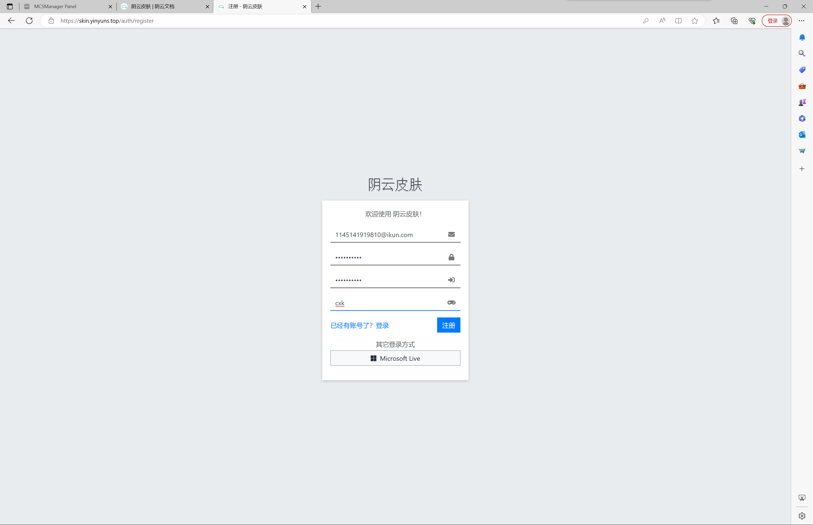

# BedRock版教程
（如果你已经完成了符合条件的BedRock版（1.19.1）的安装和调试，请跳至第 4 步） 
1.在浏览器中访问https://xz.klpbbs.net/down.php?vs=1.19.10.03_64下载1.19.1基岩版mc并安装；

2.打开mc，注册或登录微软账号；

3.在访问[阴云皮肤](https://skin.yinyuns.top/)，并参考[使用指南](/yinyunskin/guide/create-account/)进行注册登录以及皮肤设置等

4.返回首页，点击“游戏”

点击“服务器”

将列表拖至底部，点击“添加服务器”

填入服务器名称及地址，随后点击保存（服务器名称自取，服务器地址请在群公告中查看）

找到刚刚添加的服务器，点击“加入服务器”

加载完成后点击“使用Mojang账户登录”，填入自己皮肤站的账号密码并提交即可进入服务器。

