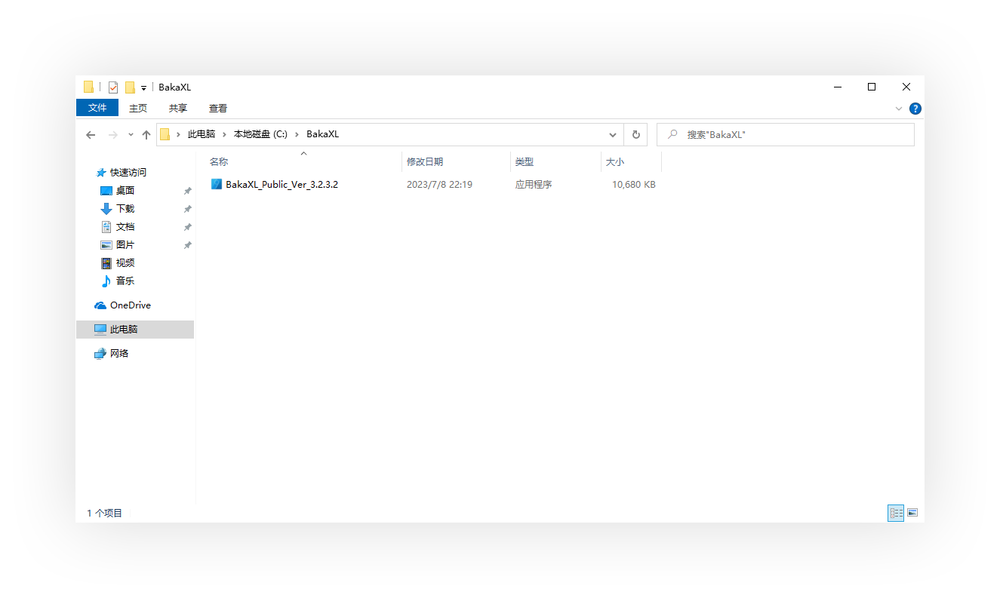
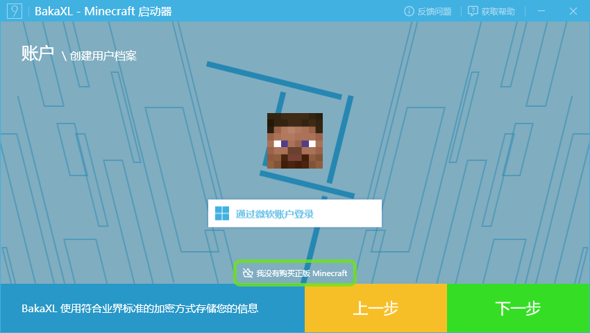
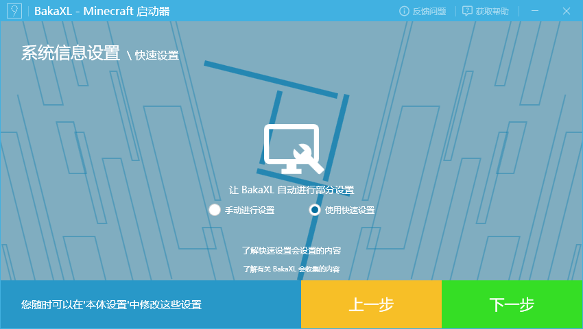
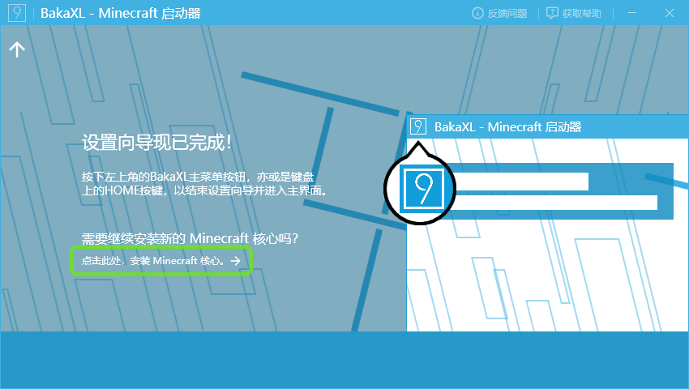
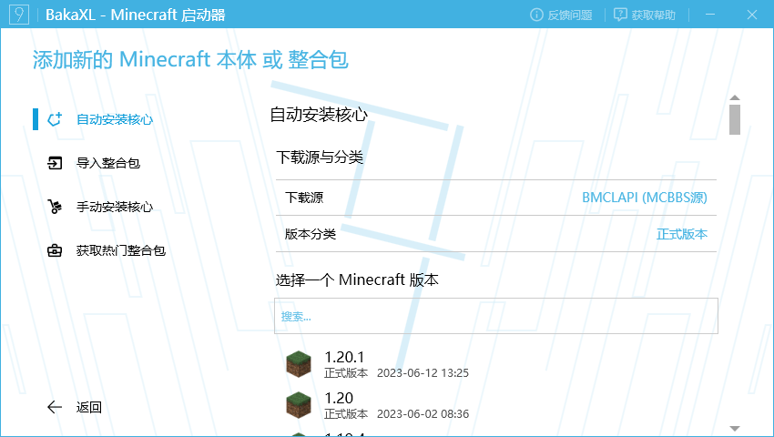
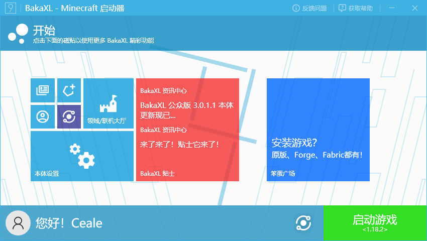
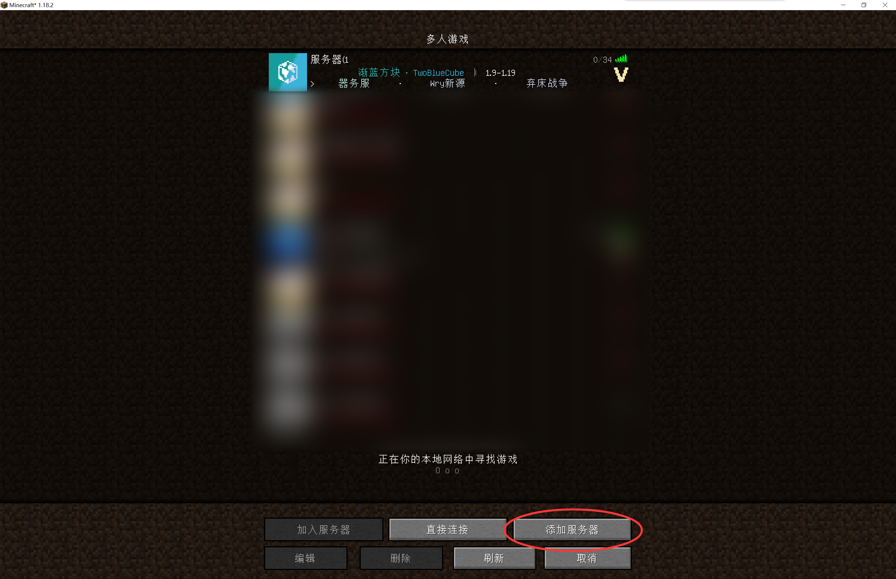
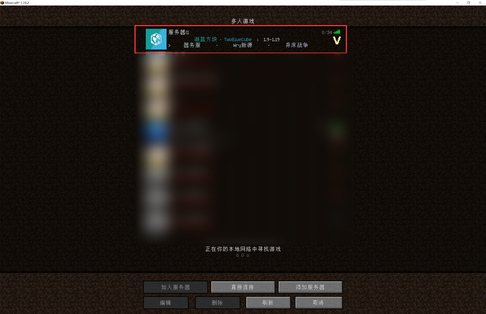
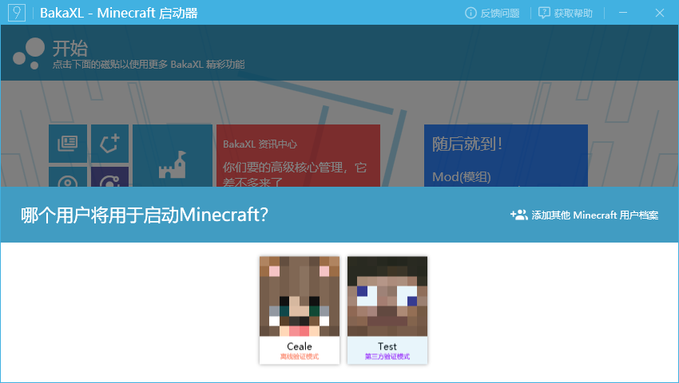

# Java版教程
（如果你已经完成了符合条件的Java版（1.9至1.19）的安装和调试，请跳至第 4 步） 
1.在群文件里找到名为“HMCL”的文件（我的世界的启动器），点击下载

下载完成后找到文件，并将其塞入一个空的文件夹中；

2.双击运行，点击启动器界面的“下载”

选择1.18.2版本(1.9至1.19的任意版本均可)下载；

2.在访问[阴云皮肤](https://skin.yinyuns.top/)，并参考[使用指南](/yinyunskin/guide/create-account/)进行注册登录以及皮肤设置等

在仪表盘中找到按钮并左键拖动至启动器，添加认证服务器

点击账户，登录皮肤站的账号并选用；

3.返回首页，点击“启动游戏”（如果你没有下载与游戏版本对应的Java版本，启动器会弹出提示，指引你完成下载 下载完成后即可启动游戏）

启动完成后，点击UI中的小地球按钮切换语言（根据自己的喜好切换）

4.点击“多人游戏”

点击“添加服务器”，填入服务器名称及地址，随后点击完成（服务器名称自取，服务器地址请在群公告中查看）

找到刚刚添加的服务器，双击即可进入服务器。
